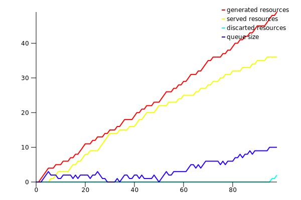

# Queue Simulator

A simple queue simulator made in rust using [`plotlib`](https://plotlib.org/)

## How It Works

Create structs for the `Generator` and `Consumer` traits, and create a `Queue`
with them. Then you just need to `tick()` the queue how many times you like and
get the final plot generated in a svg file.

## Example

`/src/bin/main.rs` has a simple example on making a queue and simulating it:

```
fn main() {
    let mut generator = SimpleGenerator::<Request>::new(Rate::Exponential { l: 0.4 });

    let mut server = SimpleServer::<Request>::new(Rate::Exponential { l: 0.2 });

    let mut queue = Queue::new(&mut generator, &mut server, Policy::FIFO, Some(10));
    for _ in 1..100 {
        queue.tick();
    }

    queue.plot("hello.svg");
}
```

Result:


